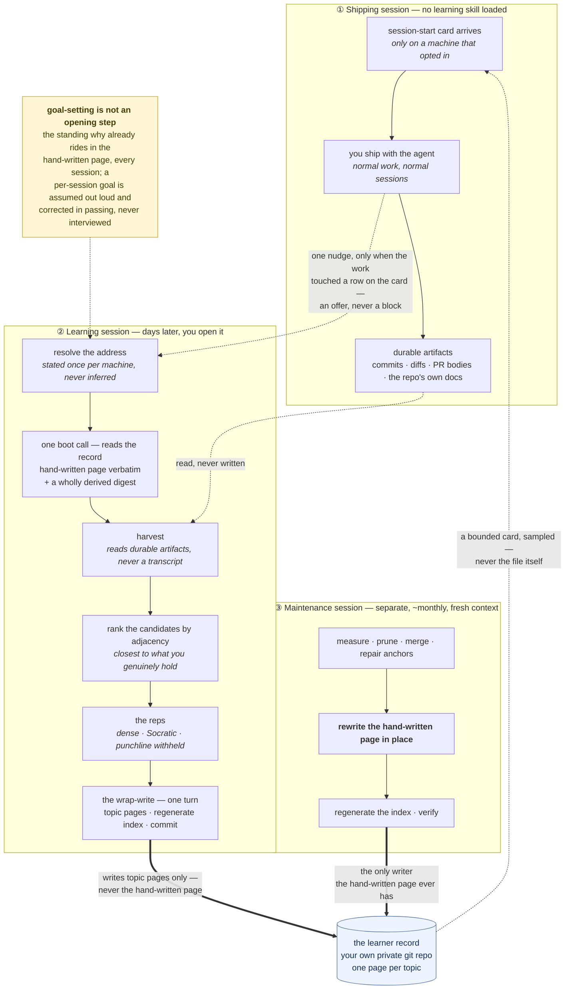

# learn-with-feedback-loop

**You are shipping more code than you understand.** An agent reads the codebase,
writes the change, explains itself well, and you say ship it. The work is correct.
The judgment that produced it accrued to the agent, and the transcript that held
it is gone the moment you start a fresh session — which you do deliberately, to
keep the context clean. Nothing is wrong, and nothing is landing.

This plugin closes that loop. It runs on **two modes, in order**:

> **You ship.** Normal work, normal sessions, no learning skill loaded. This is
> not the part you fix — it is the part that produces the material. Every fix you
> shipped is a candidate for something you could own.
>
> **Then you take one thing over.** A separate session, later. It reads what you
> actually shipped — the commits, the diffs, the docs the work updated — ranks the
> candidates by how close each one sits to what you genuinely hold already, and
> drills the closest one until you can say it back in your own words. That is the
> step that turns a candidate into something that is yours.

Two things make the second mode work rather than feel like homework.

**A record that survives the session.** The mentor knows what you own, what you
half-own, what you have never once explained out loud, and what has gone quiet
long enough to be worth re-checking. It lives in a private git repository of your
own — one page per topic, forever-growing, never in this repository — so a session
six weeks from now opens where the last one stopped instead of introducing itself.

**A mentor that meets you inside the work you were already doing.** There is no
syllabus and no separate study hour. The material is the thing you shipped on
Tuesday, and the reason you remember it is that you were already holding the
context. Ownership is earned exactly one way: you explain it, unprompted, in your
own words. Nodding along at a good explanation earns nothing, and the record says
so in plain language — a topic you skipped for time reads as *asserted*, with your
own model line left empty, and no future session can mistake that for knowledge.

**And you don't have to remember to do it.** Opt a machine in and your ordinary
sessions start already knowing who you are; when the work you are doing walks into
something on your map, the agent says so once, at the end of a turn — a 🍄 in the
middle of your build output, offering the thing you just walked past. Ignore it and
it costs you a line. [How that works](#the-nudge--how-mode-two-actually-starts).

The direction of travel is the point. The share of the code the agent writes should
trend down, the share you write should trend up, and the scaffold should fade
rather than get more comfortable.

---

## What a session actually looks like

Prose about a mentoring discipline is cheap. Here is the loop end to end, in a
generic codebase, across a deliberate context wipe. Judge it in ten seconds.

### Tuesday — you ship. No learning skill is loaded.

```
━━━━━━━━ SHIPPING SESSION · Tue ━━━━━━━━━━━━━━━━━━━━━━
 1│ you   │ the nightly load double-counts after a
 2│       │ retry. fix it.
 3│ agent │ [reads loader, adds a merge key, updates
 4│       │  docs/pipelines/nightly.md]
 5│ agent │ Done. Root cause was an INSERT on retry
 6│       │ where the first attempt had partially
 7│       │ committed. Switched to MERGE on
 8│       │ (load_date, source_id).
 9│ you   │ ship it
━━━━━━━━━━━━━━━━━━━━━━━━━━━━━━━━━━━━━━━━━━━━━━━━━━━━━
```

Nothing learning-specific is written. No trailer, no note, no residue in a
repository your colleagues share. Line **4** is the only thing that matters later
— and it happened for shipping reasons, not for this.

The session is then closed and its context discarded, as usual.

### Friday — you take it over. Turn one.

```
━━━━━━━━ LEARNING SESSION · Fri ━━━━━━━━━━━━━━━━━━━━━━
 1│ you   │ let's learn
 2│ agent │ [resolves record; runs
 3│       │  <skill>/bin/boot.sh <record>]
━━━━━━━━ boot.sh output ━━━━━━━━━━━━━━━━━━━━━━━━━━━━━━
 4│ LEARNER
 5│   taught as a builder · dense · first
 6│   principles · brief history · why built
 7│   this way · rubber-duck before moving on
 8│   mission: agent writes less each month
 9│
10│ ACTIVE — learning, open reps (2) — cap is 3
11│   lookback-windows   1/5  3d  the nightly
12│                              cost spike
13│   cte-materialisation 0/3 11d  —
14│
15│ RUSTY — owned, untouched >60d (1)
16│   batch-reprocessing  71d  probe first
17│
18│ UNVERIFIED — never explained aloud (4)
19│   retry-backoff      asserted  2026-05-11
20│
21│ 47 topics total. Full ledger: boot.sh --query all
22│ ⚠ 4 unverified · 1 rusty · 0 broken anchors
━━━━━━━━━━━━━━━━━━━━━━━━━━━━━━━━━━━━━━━━━━━━━━━━━━━━━
```

One call, one output, bounded a year in. Lines **4–8** are the hand-written page
— the only part of the record a person maintains, and the one thing a learning
session never writes. Lines **10–19** are computed from every topic page on every
run, so they cannot disagree with the record.

### Harvest, then the menu

```
━━━━━━━━━━━━━━━━━━━━━━━━━━━━━━━━━━━━━━━━━━━━━━━━━━━━━
 1│ agent │ [git log --since=7d; reads
 2│       │  docs/pipelines/nightly.md]
 3│ agent │ Tuesday you fixed the nightly double-
 4│       │ count. Three things sit under that fix.
 5│       │ Ranked by what you already hold:
 6│       │
 7│       │ 1. idempotent merges — sits directly on
 8│       │    batch-reprocessing, which you own
 9│       │ 2. transaction boundaries on retry —
10│       │    one step further out
11│       │ 3. exactly-once as a claim — mostly
12│       │    vocabulary, low value right now
13│       │
14│       │ I'd take 1. Before I can, one check:
15│       │ you owned batch-reprocessing in May and
16│       │ haven't touched it since. In one line —
17│       │ why does reprocessing a trailing slice
18│       │ not corrupt anything?
━━━━━━━━━━━━━━━━━━━━━━━━━━━━━━━━━━━━━━━━━━━━━━━━━━━━━
```

Lines **7–8** are the ranking: candidates ordered by adjacency to what you
*genuinely* hold, walked along the record's own anchor edges. Lines **14–18** are
the rule that keeps it honest — the mentor never asserts your recall back at you.
A retrieval attempt on a rusty topic is worth more than the re-teach it replaces.

### The rep, and the answer withheld

```
━━━━━━━━━━━━━━━━━━━━━━━━━━━━━━━━━━━━━━━━━━━━━━━━━━━━━
 1│ you   │ because you throw away the whole slice
 2│       │ and rewrite it, so there's no state
 3│       │ carried between runs
 4│ agent │ That holds. And it names the reason
 5│       │ the fix worked — the retry was safe
 6│       │ once the write stopped depending on
 7│       │ what the previous attempt had done.
 8│       │
 9│       │ Now the harder version. MERGE on
10│       │ (load_date, source_id) is idempotent
11│       │ for that loader. Give me one shape of
12│       │ input where the same MERGE stops being
13│       │ idempotent — same statement, same key.
14│ you   │ if two source rows collapse to the
15│       │ same key? then it depends which one
16│       │ lands last
17│ agent │ That's it, and it's the failure that
18│       │ bites in production rather than in
19│       │ review. What it's called and what the
20│       │ engine does about it is the next rep —
21│       │ but say it back in your own words
22│       │ first: what is MERGE actually
23│       │ promising you?
━━━━━━━━━━━━━━━━━━━━━━━━━━━━━━━━━━━━━━━━━━━━━━━━━━━━━
```

Lines **19–20** withhold the name on purpose. Line **21** is the sentence that
becomes your model line — and it is filled only with words you said.

### The wrap — one turn, no ceremony

```
━━━━━━━━━━━━━━━━━━━━━━━━━━━━━━━━━━━━━━━━━━━━━━━━━━━━━
 1│ you   │ merge promises the row ends up in one
 2│       │ state, not that it's the state you
 3│       │ wanted. ok wrap it up now
 4│ agent │ [writes; regenerates INDEX; commits]
 5│ agent │ That answer is the whole topic, so
 6│       │ it's logged as yours.
 7│       │
 8│       │ batch-reprocessing came back clean
 9│       │ after ten weeks — that's the spacing
10│       │ working, not luck.
11│       │
12│       │ Next time: duplicate keys have a name
13│       │ and engines have an answer for them.
14│       │ Three reps waiting.
━━━━━━━━━━━━━━━━━━━━━━━━━━━━━━━━━━━━━━━━━━━━━━━━━━━━━
```

Line **4** is the entire cost of wrapping up. Nothing is itemised back at you,
nothing you skipped is recited, and you never see a file path, a status token or
a field name. Two of the three menu topics were never opened, so **no page was
created for either** — mentioning is not engagement, and they will surface again
the next time you ship something that touches them.

### The same session, scrapped instead

```
━━━━━━━━━━━━━━━━━━━━━━━━━━━━━━━━━━━━━━━━━━━━━━━━━━━━━
 1│ you   │ actually drop it, no time
 2│ agent │ Nothing logged. The merge question is
 3│       │ still open whenever you come back.
━━━━━━━━ git status ━━━━━━━━━━━━━━━━━━━━━━━━━━━━━━━━━
 4│ nothing to commit, working tree clean
━━━━━━━━━━━━━━━━━━━━━━━━━━━━━━━━━━━━━━━━━━━━━━━━━━━━━
```

Line **4** is what makes ten concurrent sessions safe. An abandoned session is
the **cheapest** outcome for the record, not the messiest — and scrapping is
obeyed when you say it, never inferred from your mood.

---

## The loop, end to end



Two properties in that picture are load-bearing and easy to lose in prose.

**Maintenance is its own session, and it is the sole writer of the hand-written
page.** A learning session writes topic pages and regenerates the index; it never
touches the page that describes who you are. That single rule is what makes
concurrent sessions conflict-free rather than nearly conflict-free — and it is
why the pass runs on its own schedule with a fresh context window instead of being
tacked onto the end of a session that is already tired.

**Goal-setting is deliberately not a step at the start.** There is no opening
ceremony, no "what do you want to achieve today". Your standing why lives on the
hand-written page and rides into every session already; a per-session goal is
assumed out loud and corrected in passing. A goal fixed up front would fight the
adjacency ranking — it is a second opinion about the same choice, formed earlier
with less information.

---

## The nudge — how mode two actually starts

Two modes in order has one obvious failure: **you have to remember to open the
second one.** Nothing about shipping reminds you, and a system that depends on
your willpower at the end of a long day is a system that quietly stops running.

So it doesn't depend on it. Once a machine is set up, **every ordinary session
starts already knowing who you are** — a session-start hook puts a small card
into the agent's context before your first message. Not into your face: you never
see it, and it is not a report about you. It is the smallest thing that lets an
agent working on something else recognise that the something else is on your map.

**What the card is.** A recent window — the newest rows of what you have actually
touched — plus the hand-written page that says who you are. It is a **sample, not
the record**, and it says so in its own footer, because an agent that mistakes a
window for the whole thing will confidently tell you a topic is new when it has
been there for a year.

```text
RECENT — touched in the last 30d (newest 12 of 20)
  retry-semantics         queues  learning · never-said-back  0/2   4d  the queue consumer rewrite
  idempotency-keys        queues  learning                    1/2   4d  the queue consumer rewrite
  at-least-once-delivery  queues  owned                       3/3  11d  the queue consumer rewrite
```

**That is the scoreboard, and it is the honest kind.** Every row carries what
state the topic is in, how many of the reps posed to you were actually answered,
how long since it was touched, and whether you have ever said it back in your own
words. `never-said-back` is the one that stings and the one that matters: reading
about something moves nothing, agreeing with a good explanation moves nothing, and
a topic reaches **`owned` only when you explained it in your own words and those
words are what got written down**. It is a progress bar you cannot advance by
consuming — the only move that changes a row is saying the thing out loud.

**Then the agent may nudge, once.** Only when the session's work genuinely touched
something on the card, and it has to name the trigger. It gets one interruption,
competing with a screen of build output — so it does not arrive as a polite grey
sentence your eye slides past. It arrives as a **pickup**:

```text
━━━━━━━ 🍄 POWER-UP AVAILABLE ━━━━━━━
how a proxy decides which host a request belongs to

Those routing labels no longer match how this actually runs — the
flat single-port assumption is the part that breaks. Same question
as your homelab migration, wearing a container costume.

▸ twenty minutes on it now, or keep going?
━━━━━━━━━━━━━━━━━━━━━━━━━━━━━━━━━━━━━━
```

Three kinds, and the header tells you which without reading a word of the body:

| | | |
|---|---|---|
| 🍄 | **POWER-UP AVAILABLE** | a gap the work just walked into — something you don't have yet |
| ⭐ | **STARS LEFT ON THIS LEVEL** | reps left open on something already in flight |
| 👻 | **GHOST KNOWLEDGE** | never said back in your own words — looks solid, isn't safe to build on |

Here it is landing where it actually lands. You were not studying anything; it is
six in the evening and you are fixing a queue consumer:

```text
> the consumer double-processes on redeploy, fix it

  Edited worker/consumer.ts — the handler now keys on the message id and
  drops a repeat instead of re-running it.
  14 passed, 0 failed.

  ━━━━━ ⭐ STARS LEFT ON THIS LEVEL ━━━━━
  how long to wait before trying again

  Came up in the consumer you just changed — you left two reps
  open on it last time.

  ▸ want one now, or keep going?
  ━━━━━━━━━━━━━━━━━━━━━━━━━━━━━━━━━━━━━━

> keep going
```

**That is the entire cost of declining: you type two words.** No skill loads, no
session opens, nothing is logged against you, and it does not ask again. Say yes
instead and the mentoring skill loads right there, mid-repo, with the consumer you
just wrote as the material — which is the whole point of catching you here rather
than in a study session you would have had to remember to open.

**👻 is the one that stings**, and it is the honest half of the scoreboard: the
only line in the system that says out loud you have been building on top of
something you have never once explained. It looked solid every time you walked
past it, and there was never anything there.

Notice what is *not* in any of those lines: no slug, no status word, no date, no
file. The game framing is on the outside only — what it says to you is always
just the thing, in plain English.

**What it will not do** is the whole point. It never asks a question that halts
the turn. It never nudges because there is material sitting there — if your work
went nowhere near any of it, you hear nothing, and silence on a busy day is the
feature. It never speaks in the record's vocabulary: no slugs, no field names, no
status tokens, not even quoted back as a phrase. And accepting is what loads the
mentoring skill — decline and nothing further happens, no skill, no session, no
second ask.

**Opting in is structural, not a setting.** The installer registers the hook in
the same act that records your record's address, so a fresh plugin install has
nothing registered — nothing to fire and nothing to fail. Deleting that one
marked block from your instruction file turns off the card and the address
together, in a single edit. A machine that never opted in runs none of this.

---

## Install

One plugin. In Claude Code:

```
/plugin marketplace add luutuankiet/context-lab
/plugin install learn-with-feedback-loop@context-lab
```

That is enough to start. The mentoring discipline works immediately, with no
record and no further setup — it is deliberately blind to the filesystem, so it
runs unchanged in a chat window, a sandbox, or another vendor's agent.

To keep a record that survives across sessions and projects, run the installer
**once per machine**:

```bash
<skill dir>/bin/install.sh <your-private-git-url> [path]
```

The plugin lives in a cache whose path differs per machine, so the simplest way to
run that is to ask your session — *"set up my learner record, the remote is `…`"* —
and let it use the skill directory it just loaded. The script clones the record, or
seeds an empty remote from the shipped skeleton, then writes the address into your
user-scope instruction file so every future session can find it — and in the same
act registers the [session-start hook](#the-nudge--how-mode-two-actually-starts)
that delivers the card. `install.sh --where`
prints the recorded path without changing anything, which is how you check whether
a machine is already set up.

Three things about that command are not incidental:

- **The URL is always an argument.** This script ships publicly; a private remote
  baked into it would ship too.
- **The address is stated, never inferred.** Nothing guesses the location from
  where the skill happens to sit — it arrives through a plugin cache, so its own
  path differs on every machine and says nothing about where your record went. A
  guess that fails quietly produces a *second* record, which halves your history
  in a way nobody notices for months.
- **Setting up a second machine? You already have a record.** Pass the same URL.
  The installer adopts an existing remote rather than seeding over it. If you are
  unsure whether you created one, assume you did — a wrong yes costs a failed
  clone, a wrong no costs a permanently split history.

Keep that repository **private**. It is the most personal thing in the system and
it grows for years.

## Using it

Talk in natural language. There is no slash command:

```
"let's learn"
"walk me through this PR so I can own it before I take over"
"teach me closures — here's the page I'm reading: <paste>"
"I want to own how auth works in this repo"
```

The mentor loads on meaning. If a record is set up and this session can reach a
filesystem, it boots that too; if not, it builds a picture of you on the fly and
persists nothing. **You never read the record.** Everything reaches you in plain
English, in the conversation — never a file path, never a field name.

One input caveat worth knowing: the harvest reads your shipping repository's own
documentation alongside its commits, so it works best when that documentation is
maintained. That is your responsibility, not the skill's. It consumes those docs,
never mandates them, and degrades to commits-and-diffs with a one-line notice when
they are missing.

## Taking over a codebase you never wrote

For a repository rather than a concept, mode two has a heavier form: a graded,
branch-per-topic rebuild where the shipped implementation is the answer key.

The agent surveys the code and comes back with a menu of 3–8 topics — plus what
it surveyed and chose to leave out, so you can see the shape of what you are
skipping. You pick one. It writes the brief against an exact commit, creates the
exercise branch and worktree, scrapes the reference down to signatures and
contract comments, and commits that scaffold. You run no git commands.

Then you write the code, commit it, and ask for a grade. It walks the diff against
the reference and classifies every divergence as a *defensible design choice* or a
*gap* — a difference you can justify from the design pressures is a pass, not a
miss. Where the shipped code has a defect you avoided, it says so.

**One repository, one syllabus, forever.** Every session checks for an existing
track before doing anything, so a codebase is never re-surveyed and a menu you have
already seen is read back rather than re-invented.

**And the agent never writes the exercise.** It creates branches, scrapes
scaffolds, teaches and grades. A graded diff of code you did not write measures
nothing.

## For contributors

`AGENTS.md` is the contract file — read it before changing anything here. The
short version: `SKILL.md` names no path and no storage location on purpose, and
`bin/smoke.sh` asserts it; templates ship, instances never do; and the learner's
record is not in this repository and never will be.

```sh
skills/learn/bin/smoke.sh          # the assertions
scripts/gen-docs-index.sh --check  # non-zero when a docs index is stale
```

Documentation is indexed in [docs/README.md](docs/README.md) — architecture pages
for where behaviour lives, traps for failures with no error message, reference for
what is expensive to re-derive, and decision records for why the repository is
shaped the way it is.

## Lineage

The discipline began as `gsd-mentor`, a single always-on mentor *agent* with a
curated wiki. Over several versions it shed everything that was not pulling its
weight — concept pages retired, then the wiki, then the agent itself in favour of
a portable skill. It was briefly `learn-with-reps`, which named the mechanism; the
name it carries now names the thing that actually matters, which is the loop
between shipping and owning. That history lived in a predecessor repository and
stays there. This one starts from its endpoint, with a clean tree and no history
carried across.

## Acknowledgements

- Andrej Karpathy's [LLM Wiki pattern](https://gist.github.com/karpathy/442a6bf555914893e9891c11519de94f) — the architecture this grew from.
- The "writing = thinking, reading ≠ thinking" philosophy — surfaced through real use, now the central discipline.
- Vygotsky's zone of proximal development, which names the failure mode this exists to fix: a scaffold that never fades.

## License

MIT
