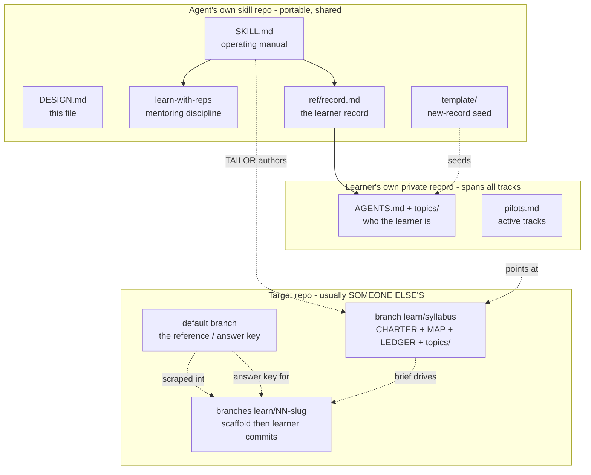
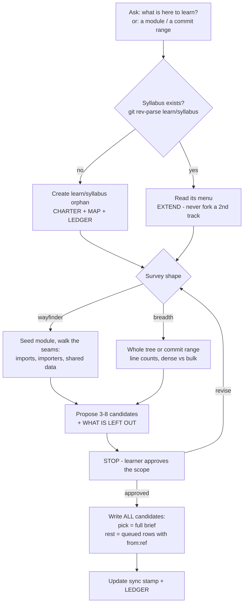
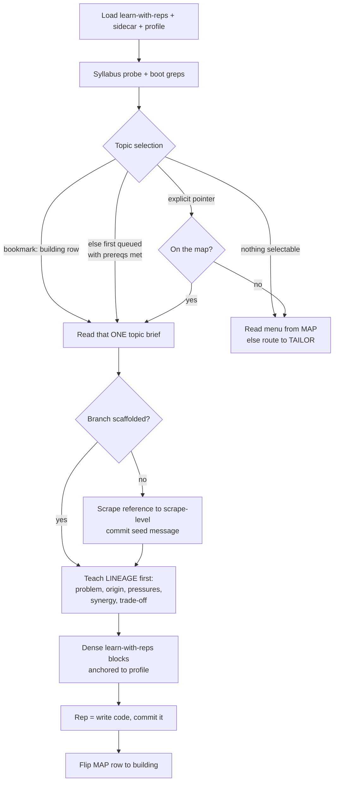
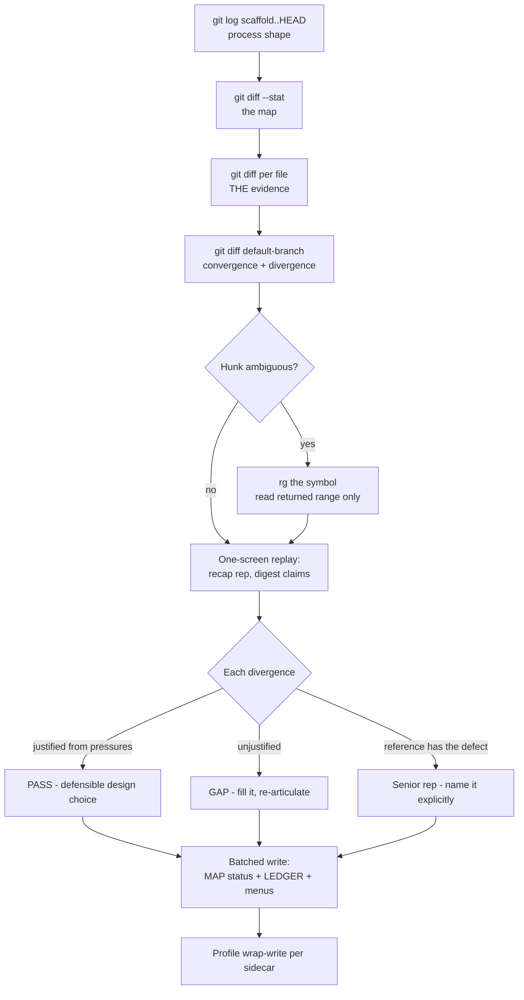
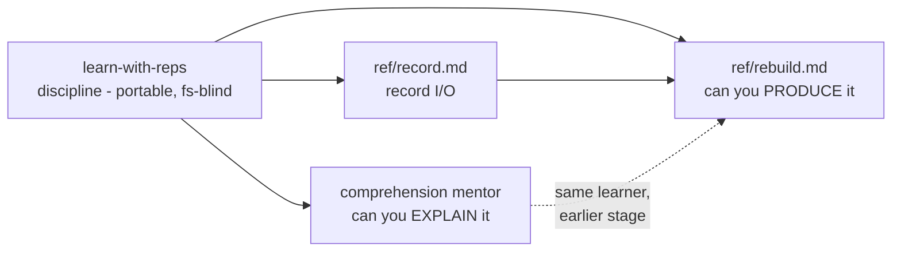

# Rebuild to own - design notes

Why the skill is shaped the way it is, what the artifacts are, and the three end-to-end flows. `SKILL.md` is the operating manual and is self-sufficient for running a session; **this file is for changing the rig, not running it.**

## Menu

| section | holds | read when |
|---|---|---|
| The problem | the cognitive debt this exists to pay | orienting; pitching it to someone |
| The core bet | git as the exercise substrate | questioning the branch model |
| Artifact graph | every file/branch and who writes it | adding or moving an artifact |
| Flow: TAILOR | surveying and menu-building | first run on a repo, or extending the map |
| Flow: TEACH | scaffolding + teaching one topic | the common path |
| Flow: GRADE | reviewing a commit | grading |
| Decisions | chosen vs rejected, with reasons | before relitigating anything |
| Invariants | what must never break | any change to the rig |
| Skill family | how the three skills compose | wiring or porting |
| Open questions | unresolved | when they bite |

## The problem

Agent-built codebases create a specific debt: the human approved the specs, discussed the architecture, reviewed the PRs - and cannot produce a line of it. Comprehension mentoring ("explain this PR to me") treats the symptom; the person can *narrate* the code and still not be able to *write* it. Reading is not thinking. Only production proves ownership.

The conventional fix - go do a course, do exercism - fails on relevance: generic katas don't build the specific system the person is on the hook for. What's wanted is exercism's format (one topic, one exercise, graded, incremental) pointed at **the actual repo**.

## The core bet: git IS the exercise substrate

Every rebuild curriculum needs three things: a blank slate to build into, a spec of what to build, and an answer key to grade against. A git repo that already contains the finished implementation supplies all three for free:

| need | supplied by |
|---|---|
| blank slate | `git worktree add --orphan` - a working dir containing only `.git` |
| spec | the scaffold commit (contract-comments + failing tests), authored by scraping the reference |
| answer key | `git show <default-branch>:<file>` and `git diff <default-branch>` - work across unrelated histories, no merge-base needed |

This is the load-bearing discovery. Because plain diff is tree-vs-tree, an orphan branch with zero shared history can still be diffed against the shipped code. No copies, no fixtures, no separate answer repo, no network. The whole rig is one repo plus branches.

Second-order consequence: **grading is a diff read, not a code read.** That is what makes the token budget of a GRADE turn bounded and why `SKILL.md` codifies a diff ladder.

## Artifact graph

**Who writes what:** the agent writes `learn/syllabus` (docs) and the scaffold commits on exercise branches. The learner writes everything else on exercise branches. Nobody writes the default branch, ever.

## Flow: TAILOR - survey and build the menu

The roadmap is built from the tree and the diff because **docs drift behind code** - in the pilot repo the written notes were materially stale while the tree was ground truth. The approval gate survives from the original design, but its job changed: branches are no longer created here, so what the learner is approving is **a scope**, which is why the proposal must name its exclusions. Wayfinder is the default shape because a years-old codebase exceeds anyone's appetite - the honest unit is a module plus its neighbours, repeated.

## Flow: TEACH - scaffold and teach one topic

Selection is a **precedence rule, not a mode**: pointer, then bookmark, then the first unblocked queued row, then the menu. A pointer at something the map has never heard of routes back to TAILOR rather than being taught alone - the neighbours are what turn a module into a route.

Lineage-before-stub is the ordering that makes a rebuild possible: a learner shown the stub first optimizes for filling the stub, a learner shown the pressure first can re-derive the stub. This is also what licenses *defensible divergence* at grading time.

## Flow: GRADE - review the commit

## Decisions - chosen vs rejected

| # | Decision | Rejected alternative | Why |
|---|---|---|---|
| 1 | Standalone skill with a mandatory load-order block | Sub-operation inside learn-with-reps | learn-with-reps is deliberately filesystem-blind and portable; embedding a git-native rig would break that. The dependency is declared, not merged. |
| 2 | All docs on one `learn/syllabus` branch | Per-branch embedded doc files | Doc files on exercise branches pollute the graded diff and drift from the central copy. The per-branch seed became the commit message instead. |
| 3 | Seed = scaffold commit message + contract-comments | A `README` in the scaffold | Same pollution argument; a commit message is metadata, not tree content, so it never shows up in a diff. |
| 4 | Status lives in the MAP header text | A separate status field or index file | Makes `rg '^### \['` equivalent to reading the whole map. Same trick the learner profile uses; proven at scale there. |
| 5 | Menu table at the top of every doc | Read the doc, decide as you go | Two consumers (planning agent, session agent) need different slices; the menu is the shared minimal-token entry point. |
| 6 | Grading via diff ladder | Read the learner's files | Bounded cost, and the delta IS the artifact under review. Full reads are the escape hatch, not the default. |
| 7 | Local-only by default | Push branches for backup | The target is usually a collaborator repo. Learned the hard way on the pilot: an initial push had to be rolled back. Consent is per repo, per session. |
| 8 | Rebuild in the reference's language | Rebuild in the language being learned | A different language forfeits the free `git diff` answer key on every sprint. Language migration becomes its own late topic instead. |
| 9 | Skill lives in the agent's skill repo | Skill lives in the target repo | The target isn't ours to write to, and the rig must be reusable across many targets. |
| 10 | TAILOR and TEACH are separate modes | One mode that surveys then teaches | Surveying is cheap and doc-only; teaching is expensive and creates branches. Fusing them makes every "what's here?" question cost a scaffold, and every lesson risk an unapproved survey. |
| 11 | Topic selection is a precedence rule | Separate resume-the-bookmark and open-a-new-topic modes | Once a pointer can be any ref, path, or topic name, the two differ only in how the topic got chosen. That is an argument, not a mode - and the learner should never have to pick a door. |
| 12 | One syllabus per repo, probed before anything else | A syllabus per entry point, or per sprint | Multiple maps mean the codebase is re-explored and menus re-brainstormed forever. Two git commands prevent it permanently. |
| 13 | Every candidate is persisted, not just the chosen one | Write the brief for the pick, discard the rest | The menu is the expensive artifact - it costs a full survey to produce. Discarding what the learner passed over guarantees re-deriving it later from the same unchanged code. |
| 14 | Wayfinder is the default survey shape | Full-tree roadmap up front | The measured behaviour is a couple of modules and then appetite runs out. Growing outward from a tip keeps every survey proportional to intent; breadth stays available on request. |
| 15 | TAILOR may overwrite queued rows freely | Preserve all map history | Learning state lives in the profile; the map only needs current coordinates. Rows at `[building]` or beyond are exempt - that is evidence of work, not a plan. |

## Invariants

1. **The default branch is read-only.** No commits, no pushes, no exceptions.
2. **`learn/*` branches are never pushed without explicit per-repo consent**, and never merged into anything. They are practice history.
3. **Exercise branches carry code only; the syllabus branch carries docs only.** Crossing this is what corrupts graded diffs.
4. **Every doc section has a menu row**, written in the same edit as the section.
5. **Status advances on evidence** (a commit exists, a teach-back happened), never on intention.
6. **The answer key is never pasted wholesale to the learner** - it is agent-facing context that licenses precise grading.
7. **The rig works fully offline.** Any dependency on a remote is a design bug.
8. **One syllabus per repo**, established by the probe before any survey, menu, or lesson.
9. **A candidate surfaced once is recorded forever.** Menus are read from the map; they are re-derived only when the sync stamp says the code moved.
10. **The answer key is a named ref**, recorded in the brief. "The default branch" is not a ref - it moves.

## Skill family

The division of labor: **learn-with-reps** owns how to teach, **the sidecar** owns learner memory, **this skill** owns the curriculum-from-a-codebase machinery. Any rule that would apply to teaching in general belongs upstream in learn-with-reps, not here - if a change to this file would improve every mentoring session, it is in the wrong file.

## Open questions

- **Excavation flavor is under-exercised.** Cutting a branch from the default branch and deleting a module (rather than starting orphan) is specified but unproven; the pilot is greenfield-first.
- **Multi-learner tracks.** The doc write rules are concurrency-safe for multiple agent sessions, but the MAP assumes one learner's progress. A shared track would need per-learner state.
- **Scrape automation.** Scaffold generation is currently agent-judgment per topic. Whether a mechanical scraper (strip bodies, keep signatures, insert throws) is better than judgment is untested.
- **Decay.** A topic marked owned months ago is not re-verified. The profile has a rusty status for this; the MAP does not yet.
- **Stale threshold is a judgment call.** "Materially behind" on the sync stamp has no number attached. Commit count is a weak proxy - a hundred commits in untouched regions matter less than three in a mapped one. Path-scoped comparison against mapped regions would be sharper, and is unbuilt.
