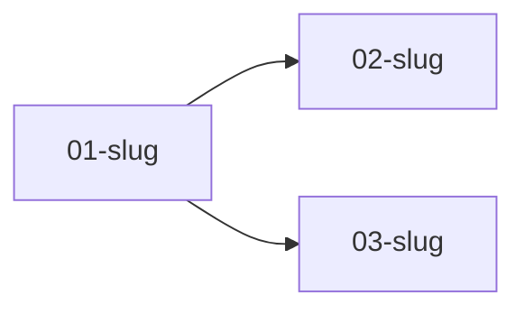

<!-- TEMPLATE. Copy to <syllabus-worktree>/learn/MAP.md and fill the <angle brackets>.
     Read by TWO greps that must never break:
       rg '^## '     learn/*.md   -> the menu rows below
       rg '^### \['  learn/MAP.md -> the topic index, state and all
     Topic state lives in the HEADER TEXT. The grep IS the read. Do not move state into bodies. -->

# MAP - <repo name>

## Menu

synced-at: <sha> (<YYYY-MM-DD>)

| section | holds | read when |
|---|---|---|
| Codebase map | the module-level tour: what lives where, what talks to what | every planning session |
| Prereq graph | topic ordering constraints | when picking what to teach next |
| Topics | the index - one `### ` row per topic, state in the header | every session, via grep |

**Sync stamp.** `synced-at:` above is the commit this map was last built against. On boot:
`git rev-list --count <synced-at-sha>..HEAD`. Materially behind, or the learner names work
this map has never heard of - say so in one line and offer a survey pass. Never silently
teach from a stale map; never silently refresh one either.

## Codebase map

<Module-level, not file-level. One line per module: what it does, what it depends on,
what depends on it. This is what lets a planning agent answer "why am I learning this"
without re-walking the tree. Grow it a neighbourhood at a time - a survey maps the module
in question plus its immediate neighbours, never the whole repo up front.>

| module | does | talks to |
|---|---|---|
| <path/> | <one line> | <modules> |

## Prereq graph

## Topics

<!-- Row grammar - ONE line, all of it in the header:
### [status] NN-slug - one-line intent - branch:learn/NN-slug - prereq:NN,NN - sittings:N - reps:a/p - from:<ref>

status: [queued] -> [scaffolded] -> [building] -> [graded] -> [owned]
from:  the commit, range, or path this candidate was derived from - provenance, so a later
       session knows where a row came from without re-deriving it.

A [queued] row may be NOTHING BUT this header line plus `from:`. That is the cheapest
durable form of a menu candidate and it is enough. Every candidate surfaced in a survey
gets one, the same turn it is proposed - a candidate that only ever existed in chat is
lost at the next compaction.

Rows at [building] or beyond keep their status, branch pointer and rep debt through any
rewrite. A survey may freely reorder, re-scope or drop [queued] rows; it may not erase
evidence of work. -->

### [queued] 01-<slug> - <one-line intent> - branch:learn/01-<slug> - prereq:none - from:<ref>

<Optional body. Only written once the topic is picked - see the topic-brief template,
which is where the teaching material actually lives. Keep this body to a pointer:
"brief: topics/01-<slug>.md".>
